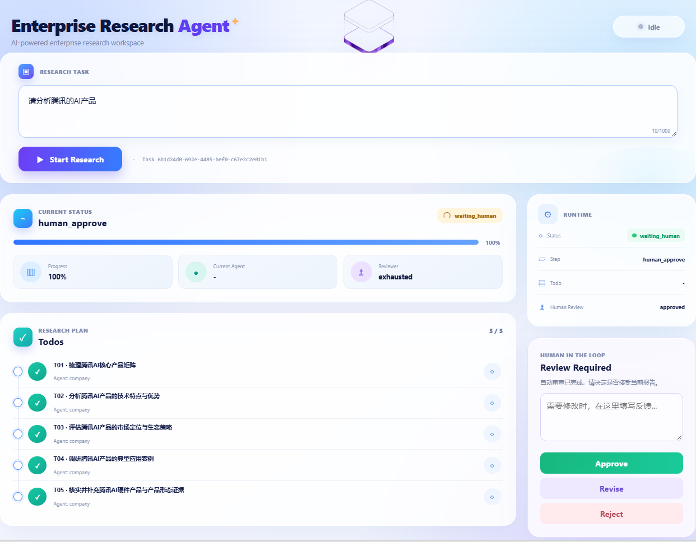

# Enterprise Research Agent

基于 LangGraph 的企业级 AI 深度研究系统。它可以自动拆解复杂问题、调度专业研究 Agent、结合互联网与内部知识库收集证据，并经过自动审查和人工审批生成可追溯的研究报告。

GitHub：<https://github.com/mlllrm241-droid/enterprise-research-agent>



## 主要功能

- Planner 自动生成和管理 Todo List
- Company、Market、Finance、Risk 等专业子 Agent
- Tavily 互联网搜索、来源记录和证据追踪
- Chroma + DashScope Embedding 企业知识库 RAG
- Manifest 增量入库：跳过未修改文件，更新或删除旧 Chunk
- SQLite Checkpoint 与任务断点保存
- 自动审查、重新规划和 Human-in-the-loop 审批
- 长期记忆、研究产物和最终报告管理
- FastAPI + SSE 实时接口与 Vue 3 前端
- Baseline、Benchmark 和 LangSmith 评估

## 执行流程

```text
提交研究任务
  → 初始化任务与 Workspace
  → 加载长期记忆
  → Planner 生成 Todo
  → Supervisor 分配专业 Agent
  → 搜索 / RAG / 保存证据
  → 循环完成 Todo
  → 汇总报告与自动审查
  → 人工 Approve / Revise / Reject
  → 保存记忆并输出最终报告
```

## 技术栈

Python 3.14、uv、LangChain、LangGraph、FastAPI、SSE、Chroma、SQLite、Tavily、DashScope、Vue 3、Vite、LangSmith。

## 项目结构

```text
enterprise-research-agent/
├─ app/
│  ├─ agents/          # Planner、Supervisor、研究、审查和记忆 Agent
│  ├─ api/             # FastAPI 入口、路由和请求模型
│  ├─ benchmark/       # Benchmark 数据模型、执行器和结果
│  ├─ checkpoint/      # LangGraph SQLite Checkpoint
│  ├─ graphs/          # 主研究工作流
│  ├─ harness/         # 调用预算、重试与上下文管理
│  ├─ memory/          # 长期记忆
│  ├─ nodes/           # Graph 业务节点
│  ├─ rag/             # 入库、Manifest、向量库和检索
│  ├─ runtime/         # 后台任务和 SSE 事件管理
│  ├─ states/          # LangGraph State
│  └─ tools/           # 搜索、计算器和知识库工具
├─ benchmarks/         # Benchmark 数据集
├─ frontend/           # Vue 3 + Vite 前端
├─ knowledge/raw/      # 待入库的内部文档
├─ scripts/            # CLI、入库和评估脚本
├─ .env.example        # 环境变量模板
├─ pyproject.toml      # Python 项目配置
└─ uv.lock             # 依赖锁文件
```

`data/`、`workspace/`、`memory/profiles/` 和 `.venv/` 是本地运行数据，默认不会上传 GitHub。

## 从 GitHub 克隆到另一台电脑

### 1. 安装工具

需要安装：

- [Git](https://git-scm.com/install/)
- [uv](https://docs.astral.sh/uv/getting-started/installation/)
- [Node.js LTS](https://nodejs.org/)

Windows PowerShell 可以执行：

```powershell
winget install --id Git.Git -e --source winget
winget install --id astral-sh.uv -e
```

安装 Node.js LTS 后，重新打开终端并检查：

```powershell
git --version
uv --version
node --version
npm --version
```

### 2. 克隆代码

```bash
git clone https://github.com/mlllrm241-droid/enterprise-research-agent.git
cd enterprise-research-agent
git switch master
```

已经克隆过时更新代码：

```bash
git pull origin master
```

## 首次安装

以下命令在项目根目录执行。

### 1. 安装 Python 与依赖

```bash
uv python install 3.14
uv sync
```

`uv sync` 会根据 `uv.lock` 创建 `.venv` 并安装锁定依赖。使用 `uv run` 时不需要手动激活虚拟环境。

### 2. 配置环境变量

Windows CMD：

```bat
copy .env.example .env
```

PowerShell：

```powershell
Copy-Item .env.example .env
```

macOS / Linux：

```bash
cp .env.example .env
```

编辑 `.env`，至少填写：

```dotenv
MIMO_API_KEY=你的_MiMo_API_Key
MIMO_BASE_URL=https://api.xiaomimimo.com/v1
MIMO_MODEL=mimo-v2.5-pro

DASHSCOPE_API_KEY=你的_DashScope_API_Key
DASHSCOPE_BASE_URL=https://dashscope.aliyuncs.com/compatible-mode/v1
DASHSCOPE_EMBEDDING_MODEL=qwen3.7-text-embedding

TAVILY_API_KEY=你的_Tavily_API_Key
```

LangSmith 可选，不使用时保持：

```dotenv
LANGSMITH_TRACING=false
LANGSMITH_API_KEY=
```

不要提交 `.env` 或任何 API Key。

### 3. 初始化知识库（推荐）

```bash
uv run python -m scripts.ingest_knowledge
```

该命令读取 `knowledge/raw/`，并将向量数据保存到 `data/chroma/`。首次运行、内部文档修改或删除后重新执行即可。

## 启动项目

### 1. 启动后端

在项目根目录打开第一个终端：

```bash
uv run uvicorn app.api.main:app --reload --host 127.0.0.1 --port 8000
```

- 健康检查：<http://127.0.0.1:8000/health>
- Swagger 文档：<http://127.0.0.1:8000/docs>

### 2. 启动前端

打开第二个终端：

```bash
cd frontend
npm install
npm run dev
```

浏览器访问 <http://127.0.0.1:5173>。本地 Vite 会把 `/api` 和 `/health` 代理到 `127.0.0.1:8000`，因此两个终端都要保持运行。

### 3. 人工审批

自动审查结束后，任务会进入 `waiting_human`：

- `Approve`：接受报告
- `Revise`：提交修改意见并继续研究
- `Reject`：拒绝报告并结束任务

最终报告位于：

```text
workspace/tasks/<task_id>/final/
```

## 命令行运行

不启动网页也可以直接运行完整 Graph：

```bash
uv run python -m scripts.run_research_graph
```

运行最简 Baseline：

```bash
uv run python -m scripts.run_baseline
```

运行一条 Benchmark Case：

```bash
uv run python -m scripts.run_benchmark --system full_harness --limit 1
```

完整 Benchmark：

```bash
uv run python -m scripts.run_benchmark --system all
```

Benchmark 会消耗搜索和模型额度，结果默认保存在 `results/benchmarks/`。

## 常见问题

### `uv` 不是内部或外部命令

完全关闭并重新打开 VS Code 或终端，让它重新读取系统 `PATH`，然后执行 `uv --version`。

### `缺少 MIMO_API_KEY` 或 `Invalid API Key`

确认根目录存在 `.env`，变量名正确，Key 前后没有多余引号或空格。

### 前端显示“创建研究任务失败”

先访问 <http://127.0.0.1:8000/health>。如果无法打开，说明后端没有启动或 8000 端口被占用。

部署在 Vercel 的前端无法访问你电脑上的 `127.0.0.1:8000`；线上使用时需要单独部署 FastAPI，并让前端指向后端公网 HTTPS 地址。

### 新电脑没有旧任务和报告

这是正常现象。GitHub 只保存源代码，不保存被 `.gitignore` 排除的 SQLite、Chroma、Workspace 和长期记忆数据。

### GitHub 拒绝上传 `checkpoints.sqlite`

确认 `.gitignore` 包含：

```gitignore
/data/checkpoints.sqlite*
```

## 安全说明

- 不要上传 `.env`、API Key、SQLite、Workspace 或企业内部研究数据。
- 当前项目适合本地学习、求职展示和单机运行。
- 公开部署前应增加身份认证、访问限流和外部持久化存储。
